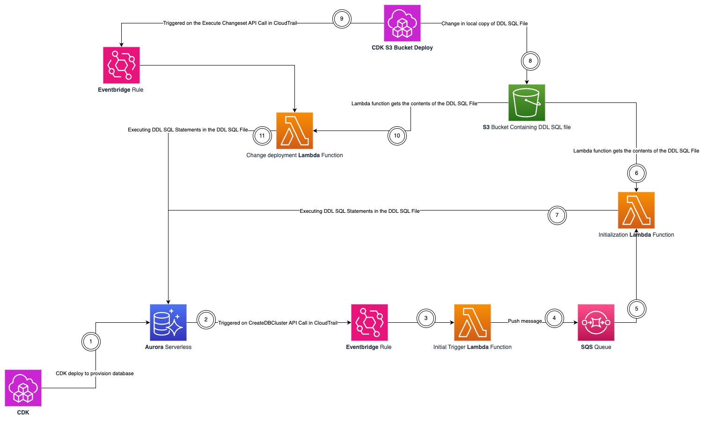

# DDL Deployment for Amazon RDS

This infrastructure shows how you can automatically deploy [DDL](https://en.wikipedia.org/wiki/Data_definition_language) (Data Definition Language) in the form of [SQL](https://en.wikipedia.org/wiki/SQL) statements (written in a file).

If your development team does not rely on application [ORMs](https://en.wikipedia.org/wiki/Object%E2%80%93relational_mapping) (Object-relational mapping) such as [Django ORM](https://www.fullstackpython.com/django-orm.html), [Alembic](https://alembic.sqlalchemy.org/en/latest/) etc; then this automated mechanism of initializing your database is an elegant serverless solution.

## Architecture



## How it works

### Maintaining the DDL in a file
The way this works is that you define your DDL (in the form of SQL statements) in a file. For this particular project, that file is the [rds-ddl.sql](./scripts/rds-ddl-sql/rds-ddl.sql) file in the [scripts directory](./scripts/).

This file gets uploaded to S3 via [S3 Bucket Deploy](https://docs.aws.amazon.com/cdk/api/v2/docs/aws-cdk-lib.aws_s3_deployment-readme.html) from [AWS CDK](https://aws.amazon.com/cdk/). The way CDK's S3 Bucket Deploy construct works is that on the first time you're deploying, it will create a bucket, and upload the contents of the local folder (that you specify in your IaC) to that bucket. And then anytime there is a change to the local files (within that folder), and you deploy the CDK stack containing this module and bucket, it will deploy the changes to the S3 bucket automatically. This way, you only have to maintain change in one script locally on your machine (or on a version control repository such as GitHub, Gitlab, BitBucket), and the Infrastructure automation takes care of the rest. 

In this project's case, the directory we use is this [rds-ddl-sql](./scripts/rds-ddl-sql/). And the file is the SQL file within that directory.

It achieves this via [Lambda](https://aws.amazon.com/lambda/) functions and [Custom Resources](https://docs.aws.amazon.com/AWSCloudFormation/latest/UserGuide/template-custom-resources.html) under the hood.

### Automation via SQS, EventBridge, and Lambda

#### At the time of database provisioning

Typical workflow for this infrastructure pattern is that an [RDS](https://aws.amazon.com/rds/) (Relational Database Service) database will get provisioned first. It will trigger an [EventBridge](https://aws.amazon.com/eventbridge/) rule configured to fire off a lambda function on the "CreateDBCluster" event in [CloudTrail](https://docs.aws.amazon.com/awscloudtrail/latest/userguide/cloudtrail-user-guide.html). That lambda function extracts the necessary information pertaining to the provisioned RDS cluster, and sends that information to an [SQS](https://aws.amazon.com/sqs/) (Simple Queue Service) queue.

This decoupling via SQS is important because not all pieces of this serverless infrastructure are (or expected to be) online at the same time. It also retains the message till a consumer deletes that message. The message in SQS gets received by a lambda function (after it is provisioned) which gets the contents of the DDL SQL file from S3, and executes the DDL SQL statements against the provisioned RDS database. 

NOTE - This demonstration project uses [Aurora Serverless](https://aws.amazon.com/rds/aurora/serverless/) V1 ([PostgreSQL](https://www.postgresql.org/) flavor) as the RDS database. The reason for this was that it exposes the [RDS Data API](https://docs.aws.amazon.com/AmazonRDS/latest/AuroraUserGuide/data-api.html). The data API provides the ability to execute queries via an HTTPS interface (as opposed to running them directly against the database). This provides a few advantages - no need to install 3rd party libraries such as [psycopg2](https://pypi.org/project/psycopg2/) on lambda; and prevent insecure access of database credentials in the source code.

#### Change in the DDL

So far the journey has covered the story till database provisioning, and how it can be initialized at (and/or after) the time its provisioned. Now, it will continue to how change in DDL is managed.
As you will see in the [alternatives](#alternatives) section (specifically the [custome resource](#pure-custom-resource-solution)) alternative, that approach relies on the change to the actual configuration (or anything that resides in that Cloudformation/CDK/IaC template) to trigger the deployment of database initialization Lambda function. But what if a user wants to change the DDL someway (and not change any other thing in the infrastructure)? 

This is where the S3 Bucket Deploy change management capabilities come into play. When you update the local copy of the DDL file, and deploy the infrastructure change via `cdk deploy ..`, it will update the file on the S3 bucket with your latest changes. Under the hood, it is calling the "ExecuteChangeset" endpoint from [Cloudformation](https://aws.amazon.com/cloudformation/) on which an EventBridge rule is configured to fire off another lambda function that fetches the latest copy of the DDL file from S3, and deploys the DDL statements against the RDS database.

And this way, anytime you want to change the DDL, simply edit the file in one location, and let the deployed serverless automation take care of the rest.

## Seeing it in action

Want to see how this works in action and deploy it in your own account? Follow through with the steps elicited below:

### Pre-requisites
* Since this is a [TypeScript](https://www.typescriptlang.org/) CDK project, you should have [npm](https://www.npmjs.com/) installed (which is the package manager for TypeScript/JavaScript).
    * You can find installation instructions for npm [here](https://docs.npmjs.com/downloading-and-installing-node-js-and-npm).

* Additionally, it would be required for your to have [AWS CLI](https://aws.amazon.com/cli/) installed on your computer.
    *  `pip install awscli`. This means need to have python installed on your computer (if it is not already installed.)
    * You need to also configure and authenticate your AWS CLI to be able to interact with AWS programmatically. Detailed instructions of how you could do that are provided [here](https://docs.aws.amazon.com/cli/latest/userguide/cli-chap-configure.html)

#### Deploy base infrastructure 
This is contained in the [base-infra-stack.ts](lib/base-infra-stack.ts) file in the [lib](./lib/) directory. It contains a [VPC](https://docs.aws.amazon.com/vpc/latest/userguide/what-is-amazon-vpc.html) (Virtual Private Cloud) for the RDS databae, the initialization detection queue, the [initialization trigger lambda function](./lambda/rds-ddl-trigger/app.py), and the EventBridge Rule that triggers on the CreateDBCluster API call.

```
npx cdk deploy BaseInfraStack

# you may optionally specify the --profile flag to specify a specific non default AWS profile
```

#### Deploy the RDS database

The IaC for the RDS database is in the [rds-stack.ts](./lib/rds-stack.ts) file in the [lib](./lib/) directory.

```
npx cdk deploy RDSStack

# you may optionally specify the --profile flag to specify a specific non default AWS profile
```
One this command finishes, you will have an RDS cluster (Aurora Serverless V1 PostgreSQL flavor) deployed in your account. 
Note - the credentials for this database will be automatically generated and stored in the [AWS Secrets Manager](https://docs.aws.amazon.com/secretsmanager/latest/userguide/intro.html).

At this point the database is not initialized with any DDL (except for the standard PostgreSQL information_schema tables)

#### Deploy the DDL Source

The IaC for the DDL source (SQL) is in the [ddl-source-rds-stack.ts](./lib/ddl-source-rds-stack.ts) file in the [lib](./lib/) directory.

```
npx cdk deploy DDLSourceRDSStack

# you may optionally specify the --profile flag to specify a specific non default AWS profile
```
This will create the S3 bucket, and deploy the [ddl-sql](./scripts/rds-ddl-sql/rds-ddl.sql) file in that S3 Bucket.

NOTE - the bucket name is configured in a way that it is `ddl-source-<RDS_DATABASE_CLUSTER_IDENTIFIER>`, so it is kind of tied to the cluster identifier of the RDS database that was deployed in the previous step. The reason for this is that it is easy to link them together. And in a realistic scenario, different databases would have different DDLs. 

#### Deploy the rest of the RDS DDL Deployment Automation
This is contained in the [rds-ddl-automation-stack.ts](./lib/rds-ddl-automation-stack.ts) file. It contains the [initialization ddl deployment lambda function](./lambda/rds-ddl-init/app.py) that deploys the DDL when the RDS database first comes online, the EventBridge rule that gets triggered on the ExecuteChangeSet API call on the `DDLSourceRDSStack` (that got deployed in the previous step), and invokes the [change ddl deployment lambda function](./lambda/rds-ddl-change/app.py), which is also defined in this stack, and executes the DDL SQL statements everytime there is a change made to the DDL file.

```
npx cdk deploy RdsDdlAutomationStack

# you may optionally specify the --profile flag to specify a specific non default AWS profile
```

If you have followed the steps till now, there should be an RDS database deployed in your AWS account. It should have also deployed 2 tables in the public schema, namely "accounts" and "roles".

#### Testing deployment of change in DDL

Now to test if the change management works as intended, open the [rds-ddl.sql](./scripts/rds-ddl-sql/rds-ddl.sql) file in your editor, and uncomment lines 19-28, and save the file. On your terminal, again run the deployment command for the DDL Source stack

```
npx cdk deploy DDLSourceRDSStack
```

This will upload the latest changes you made in the DDL file to S3. You can also navigate to S3 and verify this. Additionally, you can monitor the Lambda function that is responsible for deploying the change in DDL. You will see that it should have been invoked. And lastly, when you see your RDS database in a query editor (the AWS console also has one for RDS), you will notice that there is another table named "account_roles" that has been created in the public schema.

## Assumptions / Considerations

* For this project, the RDS database flavor chosen is Aurora Serverless V1 as it exposes a Data API. This eliminates the need to install 3rd party libraries to interact with PostgreSQL, MySQL etc. If any other flavor is chosen, the lambda function code will need to be modified to execute the DDL statements using the 3rd party library (instead of the RDS Data API)

* The DDL SQL file is expected to have a ";" as a delimiter for each SQL statement you want to have executed against the RDS database. An alternative could be a list of strings as well (that would mean changes to the code slightly)

* Because we have used CDK to deploy the solution, the RDS database is using Secrets Manager (by default) to manage its credentials. So an expectation of the solution is that Secrets Manager be used to store database credentials (as they're needed to execute SQL queries against the database). Also when the database is created using CDK, the Secret also contains details about the endpoint and cluster identifier. The lambda function queries the secrets, and goes through them to see which one is the correct secret to use (by looking at the cluster identifier value).

* The name of the S3 bucket that stores the DDL SQL file is associated with the Cluster Identifier for the RDS database. It is to be able to link the DDL with the correct cluster (as a design choice). Different databases might have different DDL associated to it. This also adds a layer of additional verification (that the bucket is indeed for the correct RDS cluster).


## Alternatives

* ### Pure custom resource solution
    There are some alternatives in this field that rely on initializing the database by putting the database IaC (Infrastructure as Code) with [Custom Resources](https://docs.aws.amazon.com/AWSCloudFormation/latest/UserGuide/template-custom-resources.html) from Cloudformation/CDK. 

    The limitation with this approach is that it relies on change to the database IaC, for the change to take affect. And it tightly couples database initialization (in the form of DDL deployment) and database configuration / change deployment. Additionally, it requires more low level implementation of custom resources to get it to work.

* ### Manual DDL deployment

    This would entail manually executing the DDL/SQL script against your database. This is potentially a security risk, and error prone. Not to mention, this requires manual intervention.

## Generic CDK Instructions

The `cdk.json` file tells the CDK Toolkit how to execute your app.

## Useful commands

* `npm run build`   compile typescript to js
* `npm run watch`   watch for changes and compile
* `npm run test`    perform the jest unit tests
* `cdk deploy`      deploy this stack to your default AWS account/region
* `cdk diff`        compare deployed stack with current state
* `cdk synth`       emits the synthesized CloudFormation template
